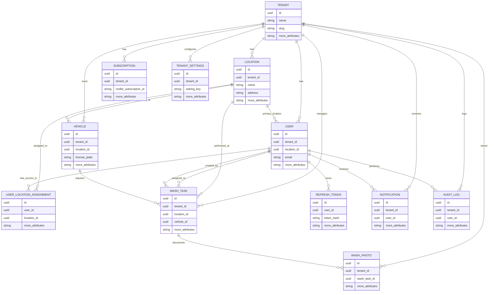

# Database Schema - Entity Relationship Diagram

## Wasplanning System Entities

## Entity Overview

### Core Entities (8)
- **TENANT** - Multi-tenant root entity
- **LOCATION** - Physical locations within each tenant
- **USER** - System users with roles (Werkplaats, Wassers, Planners, etc.)
- **USER_LOCATION_ASSIGNMENT** - Many-to-many relationship for user location access
- **VEHICLE** - Cars to be washed
- **WASH_TASK** - Wash jobs/assignments
- **SUBSCRIPTION** - Mollie payment subscriptions
- **REFRESH_TOKEN** - JWT refresh tokens

### Supporting Entities (4)
- **NOTIFICATION** - Real-time notifications system
- **WASH_PHOTO** - Before/after photos (MinIO storage)
- **AUDIT_LOG** - System audit trail
- **TENANT_SETTINGS** - Configurable garage settings

## Key Relationships

- All entities (except TENANT and REFRESH_TOKEN) are tenant-scoped
- LOCATION entities enable multi-location support within each tenant
- USER_LOCATION_ASSIGNMENT enables users to access multiple locations
- WASH_TASK is the central entity connecting users, vehicles, locations, and operations
- Complete tenant isolation ensures data separation between garages
- Location-based access control provides fine-grained permissions
- Row-Level Security policies enforce tenant and location boundaries at database level