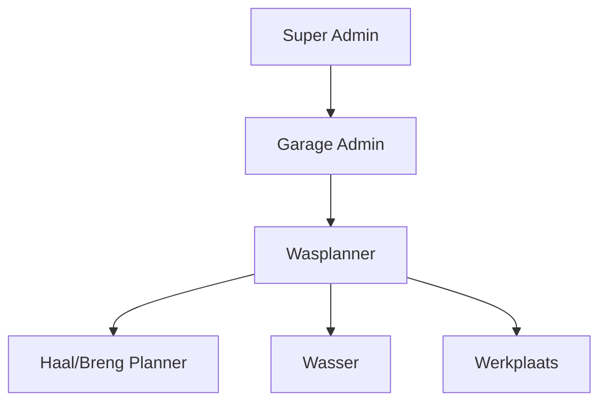

# Multi-Tenancy, Authentication & Authorization Technical Specification

## Table of Contents
1. [Overview](#overview)
2. [User Roles & Permissions](#user-roles--permissions)
3. [Database Schema](#database-schema)
4. [Backend Implementation](#backend-implementation)
5. [Frontend Implementation](#frontend-implementation)
6. [Security Considerations](#security-considerations)
7. [Migration Strategy](#migration-strategy)

## Overview

This document defines the complete multi-tenancy, authentication, and authorization architecture for the Wasplanning system. The system supports complete tenant isolation while providing flexible role-based access control within each tenant. Each tenant can have multiple physical locations.

### Key Principles
- **Complete Tenant Isolation**: No data leakage between tenants
- **Multi-Location Support**: Each tenant can manage multiple physical locations
- **Location-Aware Access**: Users can be assigned to specific locations within their tenant
- **Row-Level Security**: Database-enforced tenant boundaries
- **JWT-Based Auth**: Stateless authentication with tenant and location context
- **Role-Based Access**: 6 hierarchical roles with specific permissions
- **Fail-Secure**: Default deny, explicit allow

## User Roles & Permissions

### Role Hierarchy



### Permission Matrix

| Resource | Super Admin | Garage Admin | Wasplanner | H/B Planner | Wasser | Werkplaats |
|----------|------------|--------------|------------|-------------|---------|------------|
| **Tenants** |
| Create Tenant | ✅ | ❌ | ❌ | ❌ | ❌ | ❌ |
| View All Tenants | ✅ | ❌ | ❌ | ❌ | ❌ | ❌ |
| Update Tenant | ✅ | ✅* | ❌ | ❌ | ❌ | ❌ |
| Delete Tenant | ✅ | ❌ | ❌ | ❌ | ❌ | ❌ |
| **Users** |
| Create User | ✅ | ✅* | ❌ | ❌ | ❌ | ❌ |
| View Users | ✅ | ✅* | ✅* | ❌ | ❌ | ❌ |
| Update User | ✅ | ✅* | ❌ | ❌ | ❌ | ❌ |
| Delete User | ✅ | ✅* | ❌ | ❌ | ❌ | ❌ |
| **Wash Tasks** |
| Create Task | ✅ | ✅ | ✅ | ❌ | ❌ | ✅ |
| View All Tasks | ✅ | ✅ | ✅ | ✅ | ✅ | ❌ |
| Assign Task | ✅ | ✅ | ✅ | ❌ | ❌ | ❌ |
| Update Status | ✅ | ✅ | ✅ | ❌ | ✅ | ❌ |
| **Reports** |
| View Reports | ✅ | ✅ | ✅ | ❌ | ❌ | ❌ |
| Export Data | ✅ | ✅ | ✅ | ❌ | ❌ | ❌ |

*Only within their tenant

## Database Schema

### Core Tables

```sql
-- Tenants table (no tenant_id as this is the root)
CREATE TABLE tenants (
    id UUID PRIMARY KEY DEFAULT gen_random_uuid(),
    slug VARCHAR(50) UNIQUE NOT NULL,
    name VARCHAR(100) NOT NULL,
    logo_url VARCHAR(500),
    settings JSONB DEFAULT '{}',
    is_active BOOLEAN DEFAULT true,
    created_at TIMESTAMP DEFAULT CURRENT_TIMESTAMP,
    updated_at TIMESTAMP DEFAULT CURRENT_TIMESTAMP
);

-- Locations table for multi-location support per tenant
CREATE TABLE locations (
    id UUID PRIMARY KEY DEFAULT gen_random_uuid(),
    tenant_id UUID NOT NULL REFERENCES tenants(id) ON DELETE CASCADE,
    name VARCHAR(100) NOT NULL,
    address TEXT,
    settings JSONB DEFAULT '{}',
    is_active BOOLEAN DEFAULT true,
    created_at TIMESTAMP DEFAULT CURRENT_TIMESTAMP,
    updated_at TIMESTAMP DEFAULT CURRENT_TIMESTAMP,
    UNIQUE(tenant_id, name)
);

-- Users table with tenant and location isolation
CREATE TABLE users (
    id UUID PRIMARY KEY DEFAULT gen_random_uuid(),
    tenant_id UUID NOT NULL REFERENCES tenants(id) ON DELETE CASCADE,
    location_id UUID REFERENCES locations(id) ON DELETE SET NULL,
    email VARCHAR(255) NOT NULL,
    password_hash VARCHAR(255) NOT NULL,
    role VARCHAR(50) NOT NULL CHECK (role IN ('super_admin', 'garage_admin', 'wasplanner', 'hb_planner', 'wasser', 'werkplaats')),
    first_name VARCHAR(100),
    last_name VARCHAR(100),
    skills TEXT[],
    is_active BOOLEAN DEFAULT true,
    last_login TIMESTAMP,
    created_at TIMESTAMP DEFAULT CURRENT_TIMESTAMP,
    updated_at TIMESTAMP DEFAULT CURRENT_TIMESTAMP,
    UNIQUE(tenant_id, email)
);

-- User-Location assignments for multi-location access
CREATE TABLE user_location_assignments (
    id UUID PRIMARY KEY DEFAULT gen_random_uuid(),
    user_id UUID NOT NULL REFERENCES users(id) ON DELETE CASCADE,
    location_id UUID NOT NULL REFERENCES locations(id) ON DELETE CASCADE,
    created_at TIMESTAMP DEFAULT CURRENT_TIMESTAMP,
    UNIQUE(user_id, location_id)
);

-- Vehicles with tenant and location isolation
CREATE TABLE vehicles (
    id UUID PRIMARY KEY DEFAULT gen_random_uuid(),
    tenant_id UUID NOT NULL REFERENCES tenants(id) ON DELETE CASCADE,
    location_id UUID REFERENCES locations(id) ON DELETE SET NULL,
    license_plate VARCHAR(20) NOT NULL,
    make VARCHAR(50),
    model VARCHAR(50),
    color VARCHAR(30),
    vin VARCHAR(50),
    created_at TIMESTAMP DEFAULT CURRENT_TIMESTAMP,
    UNIQUE(tenant_id, license_plate)
);

-- Wash tasks with tenant and location isolation
CREATE TABLE wash_tasks (
    id UUID PRIMARY KEY DEFAULT gen_random_uuid(),
    tenant_id UUID NOT NULL REFERENCES tenants(id) ON DELETE CASCADE,
    location_id UUID REFERENCES locations(id) ON DELETE SET NULL,
    vehicle_id UUID NOT NULL REFERENCES vehicles(id),
    assigned_user_id UUID REFERENCES users(id),
    created_by_id UUID NOT NULL REFERENCES users(id),
    status VARCHAR(50) NOT NULL DEFAULT 'pending',
    priority VARCHAR(20) DEFAULT 'normal',
    wash_type VARCHAR(50) NOT NULL,
    estimated_duration INTEGER, -- minutes
    actual_duration INTEGER,
    return_time TIMESTAMP,
    started_at TIMESTAMP,
    completed_at TIMESTAMP,
    notes TEXT,
    created_at TIMESTAMP DEFAULT CURRENT_TIMESTAMP,
    updated_at TIMESTAMP DEFAULT CURRENT_TIMESTAMP
);

-- Session/refresh tokens (optional, for refresh token rotation)
CREATE TABLE refresh_tokens (
    id UUID PRIMARY KEY DEFAULT gen_random_uuid(),
    user_id UUID NOT NULL REFERENCES users(id) ON DELETE CASCADE,
    token_hash VARCHAR(255) NOT NULL UNIQUE,
    expires_at TIMESTAMP NOT NULL,
    created_at TIMESTAMP DEFAULT CURRENT_TIMESTAMP
);
```

### Row-Level Security Policies

```sql
-- Enable RLS on all tenant-scoped tables
ALTER TABLE locations ENABLE ROW LEVEL SECURITY;
ALTER TABLE users ENABLE ROW LEVEL SECURITY;
ALTER TABLE vehicles ENABLE ROW LEVEL SECURITY;
ALTER TABLE wash_tasks ENABLE ROW LEVEL SECURITY;
ALTER TABLE user_location_assignments ENABLE ROW LEVEL SECURITY;

-- Create RLS policies for tenant isolation
CREATE POLICY tenant_isolation_policy ON locations
    USING (tenant_id = current_setting('app.current_tenant')::uuid);

CREATE POLICY tenant_isolation_policy ON users
    USING (tenant_id = current_setting('app.current_tenant')::uuid);

CREATE POLICY tenant_isolation_policy ON vehicles
    USING (tenant_id = current_setting('app.current_tenant')::uuid);

CREATE POLICY tenant_isolation_policy ON wash_tasks
    USING (tenant_id = current_setting('app.current_tenant')::uuid);

CREATE POLICY tenant_isolation_policy ON user_location_assignments
    USING (user_id IN (SELECT id FROM users WHERE tenant_id = current_setting('app.current_tenant')::uuid));

-- Additional policies for location-based access
CREATE POLICY location_access_policy ON wash_tasks
    USING (
        location_id IS NULL OR
        location_id IN (
            SELECT location_id FROM user_location_assignments 
            WHERE user_id = current_setting('app.current_user')::uuid
        ) OR
        EXISTS (
            SELECT 1 FROM users 
            WHERE id = current_setting('app.current_user')::uuid 
            AND role IN ('garage_admin', 'wasplanner', 'super_admin')
        )
    );

-- Super admin bypass policy
CREATE POLICY super_admin_bypass ON users
    USING (
        EXISTS (
            SELECT 1 FROM users
            WHERE id = current_setting('app.current_user')::uuid
            AND role = 'super_admin'
        )
    );
```

## Backend Implementation

### JWT Token Structure

```typescript
interface JWTPayload {
  sub: string;          // user.id
  email: string;
  role: UserRole;
  tenantId: string;     // tenant.id
  tenantSlug: string;   // tenant.slug
  locationId?: string;  // user's primary location
  locationIds: string[]; // all accessible locations for this user
  permissions: string[]; // Computed permissions based on role
  iat: number;
  exp: number;
}
```

### Authentication Flow

```typescript
// auth.service.ts
@Injectable()
export class AuthService {
  constructor(
    private usersService: UsersService,
    private jwtService: JwtService,
    private configService: ConfigService,
  ) {}

  async login(email: string, password: string, tenantSlug: string) {
    // 1. Find tenant by slug
    const tenant = await this.tenantsService.findBySlug(tenantSlug);
    if (!tenant || !tenant.is_active) {
      throw new UnauthorizedException('Invalid tenant');
    }

    // 2. Find user within tenant
    const user = await this.usersService.findByEmail(email, tenant.id);
    if (!user || !user.is_active) {
      throw new UnauthorizedException('Invalid credentials');
    }

    // 3. Verify password
    const isPasswordValid = await bcrypt.compare(password, user.password_hash);
    if (!isPasswordValid) {
      throw new UnauthorizedException('Invalid credentials');
    }

    // 4. Generate tokens
    const tokens = await this.generateTokens(user, tenant);
    
    // 5. Update last login
    await this.usersService.updateLastLogin(user.id);

    return {
      access_token: tokens.accessToken,
      refresh_token: tokens.refreshToken,
      user: {
        id: user.id,
        email: user.email,
        role: user.role,
        name: `${user.first_name} ${user.last_name}`,
        tenant: {
          id: tenant.id,
          name: tenant.name,
          slug: tenant.slug,
        },
      },
    };
  }

  private async generateTokens(user: User, tenant: Tenant) {
    const permissions = this.getPermissionsForRole(user.role);
    
    const payload: JWTPayload = {
      sub: user.id,
      email: user.email,
      role: user.role,
      tenantId: tenant.id,
      tenantSlug: tenant.slug,
      permissions,
    };

    const [accessToken, refreshToken] = await Promise.all([
      this.jwtService.signAsync(payload, {
        expiresIn: '15m',
      }),
      this.jwtService.signAsync(payload, {
        expiresIn: '7d',
      }),
    ]);

    // Store refresh token hash in database
    await this.storeRefreshToken(user.id, refreshToken);

    return { accessToken, refreshToken };
  }

  private getPermissionsForRole(role: UserRole): string[] {
    const permissionMap = {
      super_admin: ['*'], // All permissions
      garage_admin: [
        'tenant:read',
        'tenant:update:own',
        'user:*:own_tenant',
        'wash_task:*:own_tenant',
        'report:*:own_tenant',
      ],
      wasplanner: [
        'user:read:own_tenant',
        'wash_task:*:own_tenant',
        'report:read:own_tenant',
      ],
      hb_planner: [
        'wash_task:read:own_tenant',
      ],
      wasser: [
        'wash_task:read:own_tenant',
        'wash_task:update_status:own_tenant',
      ],
      werkplaats: [
        'wash_task:create:own_tenant',
      ],
    };

    return permissionMap[role] || [];
  }
}
```

### Tenant Context Middleware

```typescript
// tenant.middleware.ts
@Injectable()
export class TenantMiddleware implements NestMiddleware {
  constructor(private readonly connection: Connection) {}

  async use(req: Request, res: Response, next: NextFunction) {
    // Extract tenant from JWT (already validated by JWT strategy)
    const user = req.user as JWTPayload;
    
    if (user && user.tenantId) {
      // Set PostgreSQL session variable for RLS
      await this.connection.query(
        `SET LOCAL app.current_tenant = '${user.tenantId}'`
      );
      
      // Set user context for super admin checks
      await this.connection.query(
        `SET LOCAL app.current_user = '${user.sub}'`
      );
      
      // Add tenant to request for easy access
      req['tenant'] = {
        id: user.tenantId,
        slug: user.tenantSlug,
      };
    }
    
    next();
  }
}
```

### Guards and Decorators

```typescript
// roles.guard.ts
@Injectable()
export class RolesGuard implements CanActivate {
  constructor(private reflector: Reflector) {}

  canActivate(context: ExecutionContext): boolean {
    const requiredRoles = this.reflector.getAllAndOverride<UserRole[]>(
      ROLES_KEY,
      [context.getHandler(), context.getClass()]
    );
    
    if (!requiredRoles) {
      return true;
    }

    const { user } = context.switchToHttp().getRequest();
    
    // Super admin can access everything
    if (user.role === 'super_admin') {
      return true;
    }
    
    return requiredRoles.includes(user.role);
  }
}

// permissions.guard.ts
@Injectable()
export class PermissionsGuard implements CanActivate {
  constructor(private reflector: Reflector) {}

  canActivate(context: ExecutionContext): boolean {
    const requiredPermissions = this.reflector.getAllAndOverride<string[]>(
      PERMISSIONS_KEY,
      [context.getHandler(), context.getClass()]
    );
    
    if (!requiredPermissions) {
      return true;
    }

    const { user } = context.switchToHttp().getRequest();
    
    // Check if user has any of the required permissions
    return requiredPermissions.some(permission => {
      // Super admin bypass
      if (user.permissions.includes('*')) return true;
      
      // Check exact permission
      if (user.permissions.includes(permission)) return true;
      
      // Check wildcard permissions (e.g., 'user:*:own_tenant')
      const userPermissionParts = user.permissions.map(p => p.split(':'));
      const requiredParts = permission.split(':');
      
      return userPermissionParts.some(parts => {
        return parts.every((part, index) => {
          return part === '*' || part === requiredParts[index];
        });
      });
    });
  }
}

// Decorators
export const Roles = (...roles: UserRole[]) => SetMetadata(ROLES_KEY, roles);
export const Permissions = (...permissions: string[]) => 
  SetMetadata(PERMISSIONS_KEY, permissions);
```

### Controller Example

```typescript
// wash-tasks.controller.ts
@Controller('wash-tasks')
@UseGuards(JwtAuthGuard, RolesGuard, PermissionsGuard)
export class WashTasksController {
  constructor(private readonly washTasksService: WashTasksService) {}

  @Post()
  @Permissions('wash_task:create:own_tenant')
  async create(@Body() dto: CreateWashTaskDto, @Req() req) {
    return this.washTasksService.create({
      ...dto,
      tenant_id: req.tenant.id,
      created_by_id: req.user.sub,
    });
  }

  @Get()
  @Permissions('wash_task:read:own_tenant')
  async findAll(@Query() query: WashTaskQueryDto, @Req() req) {
    // Service automatically filters by tenant due to RLS
    return this.washTasksService.findAll(query);
  }

  @Patch(':id/assign')
  @Roles('wasplanner', 'garage_admin')
  @Permissions('wash_task:assign:own_tenant')
  async assign(
    @Param('id') id: string,
    @Body() dto: AssignWashTaskDto,
    @Req() req,
  ) {
    return this.washTasksService.assign(id, dto.userId);
  }

  @Patch(':id/status')
  @Permissions('wash_task:update_status:own_tenant')
  async updateStatus(
    @Param('id') id: string,
    @Body() dto: UpdateStatusDto,
    @Req() req,
  ) {
    // Additional check: wassers can only update their own assigned tasks
    if (req.user.role === 'wasser') {
      const task = await this.washTasksService.findOne(id);
      if (task.assigned_user_id !== req.user.sub) {
        throw new ForbiddenException('Can only update own assigned tasks');
      }
    }
    
    return this.washTasksService.updateStatus(id, dto.status);
  }
}
```

## Frontend Implementation

### Authentication Store (Pinia)

```typescript
// stores/auth.ts
export const useAuthStore = defineStore('auth', () => {
  const config = useRuntimeConfig()
  const router = useRouter()
  
  // State
  const user = ref<User | null>(null)
  const tenant = ref<Tenant | null>(null)
  const accessToken = ref<string | null>(null)
  const refreshToken = ref<string | null>(null)
  const isAuthenticated = computed(() => !!accessToken.value)
  
  // Persist tokens in secure httpOnly cookies via API
  const { $fetch } = useNuxtApp()
  
  // Actions
  async function login(email: string, password: string, tenantSlug: string) {
    try {
      const response = await $fetch('/api/auth/login', {
        method: 'POST',
        body: { email, password, tenantSlug },
      })
      
      user.value = response.user
      tenant.value = response.user.tenant
      accessToken.value = response.access_token
      refreshToken.value = response.refresh_token
      
      // Store tokens securely
      await $fetch('/api/auth/session', {
        method: 'POST',
        body: {
          access_token: response.access_token,
          refresh_token: response.refresh_token,
        },
      })
      
      // Redirect based on role
      const roleRedirects = {
        super_admin: '/admin',
        garage_admin: '/admin/garage',
        wasplanner: '/planner',
        hb_planner: '/planner/deliveries',
        wasser: '/washer',
        werkplaats: '/workshop',
      }
      
      await router.push(roleRedirects[user.value.role] || '/dashboard')
    } catch (error) {
      throw error
    }
  }
  
  async function logout() {
    try {
      await $fetch('/api/auth/logout', { method: 'POST' })
    } finally {
      user.value = null
      tenant.value = null
      accessToken.value = null
      refreshToken.value = null
      await router.push('/login')
    }
  }
  
  async function refreshAccessToken() {
    if (!refreshToken.value) {
      throw new Error('No refresh token available')
    }
    
    try {
      const response = await $fetch('/api/auth/refresh', {
        method: 'POST',
        body: { refresh_token: refreshToken.value },
      })
      
      accessToken.value = response.access_token
      
      // Update stored token
      await $fetch('/api/auth/session', {
        method: 'PATCH',
        body: { access_token: response.access_token },
      })
      
      return response.access_token
    } catch (error) {
      await logout()
      throw error
    }
  }
  
  // Permission helpers
  function hasRole(...roles: UserRole[]): boolean {
    if (!user.value) return false
    if (user.value.role === 'super_admin') return true
    return roles.includes(user.value.role)
  }
  
  function hasPermission(permission: string): boolean {
    if (!user.value) return false
    return checkPermission(user.value.role, permission)
  }
  
  function canAccessTenant(tenantId: string): boolean {
    if (!user.value || !tenant.value) return false
    if (user.value.role === 'super_admin') return true
    return tenant.value.id === tenantId
  }
  
  return {
    user: readonly(user),
    tenant: readonly(tenant),
    isAuthenticated: readonly(isAuthenticated),
    login,
    logout,
    refreshAccessToken,
    hasRole,
    hasPermission,
    canAccessTenant,
  }
})
```

### API Interceptor with Auto-Refresh

```typescript
// plugins/api.client.ts
export default defineNuxtPlugin(() => {
  const { $fetch } = useNuxtApp()
  const authStore = useAuthStore()
  const config = useRuntimeConfig()
  
  // Create custom fetch instance
  const api = $fetch.create({
    baseURL: config.public.apiUrl,
    onRequest({ request, options }) {
      // Add auth header if available
      if (authStore.isAuthenticated) {
        options.headers = {
          ...options.headers,
          Authorization: `Bearer ${authStore.accessToken}`,
        }
      }
      
      // Add tenant context header
      if (authStore.tenant) {
        options.headers = {
          ...options.headers,
          'X-Tenant-ID': authStore.tenant.id,
        }
      }
    },
    onResponseError({ request, response, options }) {
      // Handle 401 Unauthorized
      if (response.status === 401) {
        // Try to refresh token
        return authStore.refreshAccessToken()
          .then((newToken) => {
            // Retry original request with new token
            options.headers = {
              ...options.headers,
              Authorization: `Bearer ${newToken}`,
            }
            return $fetch(request, options)
          })
          .catch(() => {
            // Refresh failed, redirect to login
            return navigateTo('/login')
          })
      }
    },
  })
  
  return {
    provide: {
      api,
    },
  }
})
```

### Route Guards

```typescript
// middleware/auth.ts
export default defineNuxtRouteMiddleware((to, from) => {
  const authStore = useAuthStore()
  
  if (!authStore.isAuthenticated) {
    return navigateTo('/login')
  }
})

// middleware/role.ts
export default defineNuxtRouteMiddleware((to, from) => {
  const authStore = useAuthStore()
  
  // Get required roles from route meta
  const requiredRoles = to.meta.roles as UserRole[] | undefined
  
  if (requiredRoles && !authStore.hasRole(...requiredRoles)) {
    throw createError({
      statusCode: 403,
      statusMessage: 'Access Denied',
    })
  }
})

// middleware/tenant.ts
export default defineNuxtRouteMiddleware((to, from) => {
  const authStore = useAuthStore()
  const tenantSlug = to.params.tenant as string
  
  // Super admins can access any tenant
  if (authStore.user?.role === 'super_admin') {
    return
  }
  
  // Check if user belongs to the tenant in the URL
  if (tenantSlug && authStore.tenant?.slug !== tenantSlug) {
    throw createError({
      statusCode: 403,
      statusMessage: 'Access Denied',
    })
  }
})
```

### Page Examples

```vue
<!-- pages/login.vue -->
<template>
  <div class="min-h-screen flex items-center justify-center">
    <div class="max-w-md w-full space-y-8">
      <div>
        <h2 class="text-3xl font-bold text-center">
          Inloggen Wasplanning
        </h2>
      </div>
      
      <form @submit.prevent="handleLogin" class="space-y-6">
        <div>
          <label for="tenant" class="block text-sm font-medium">
            Garage Code
          </label>
          <input
            id="tenant"
            v-model="form.tenantSlug"
            type="text"
            required
            class="mt-1 block w-full rounded-md border-gray-300"
            placeholder="garage-utrecht"
          />
        </div>
        
        <div>
          <label for="email" class="block text-sm font-medium">
            Email
          </label>
          <input
            id="email"
            v-model="form.email"
            type="email"
            required
            class="mt-1 block w-full rounded-md border-gray-300"
          />
        </div>
        
        <div>
          <label for="password" class="block text-sm font-medium">
            Wachtwoord
          </label>
          <input
            id="password"
            v-model="form.password"
            type="password"
            required
            class="mt-1 block w-full rounded-md border-gray-300"
          />
        </div>
        
        <button
          type="submit"
          :disabled="loading"
          class="w-full flex justify-center py-2 px-4 border border-transparent rounded-md shadow-sm text-sm font-medium text-white bg-indigo-600 hover:bg-indigo-700 focus:outline-none focus:ring-2 focus:ring-offset-2 focus:ring-indigo-500"
        >
          {{ loading ? 'Bezig...' : 'Inloggen' }}
        </button>
        
        <div v-if="error" class="text-red-600 text-sm text-center">
          {{ error }}
        </div>
      </form>
    </div>
  </div>
</template>

<script setup lang="ts">
// No auth middleware on login page
definePageMeta({
  layout: 'auth',
})

const authStore = useAuthStore()
const loading = ref(false)
const error = ref('')

const form = reactive({
  tenantSlug: '',
  email: '',
  password: '',
})

async function handleLogin() {
  loading.value = true
  error.value = ''
  
  try {
    await authStore.login(form.email, form.password, form.tenantSlug)
  } catch (err) {
    error.value = 'Ongeldige inloggegevens'
  } finally {
    loading.value = false
  }
}
</script>
```

```vue
<!-- pages/washer/index.vue -->
<template>
  <div>
    <h1 class="text-2xl font-bold mb-6">
      Mijn Wastaken
    </h1>
    
    <div class="space-y-4">
      <WashTaskCard
        v-for="task in tasks"
        :key="task.id"
        :task="task"
        @update-status="updateTaskStatus"
      />
    </div>
  </div>
</template>

<script setup lang="ts">
// Protect this page
definePageMeta({
  middleware: ['auth', 'role'],
  roles: ['wasser', 'wasplanner', 'garage_admin', 'super_admin'],
})

const { $api } = useNuxtApp()
const authStore = useAuthStore()

// Fetch tasks assigned to current washer
const { data: tasks, refresh } = await useAsyncData(
  'washer-tasks',
  () => $api('/wash-tasks', {
    query: {
      assigned_user_id: authStore.user?.id,
      status: ['pending', 'in_progress'],
    },
  })
)

async function updateTaskStatus(taskId: string, status: string) {
  try {
    await $api(`/wash-tasks/${taskId}/status`, {
      method: 'PATCH',
      body: { status },
    })
    
    await refresh()
    
    // Show success message
    const toast = useToast()
    toast.add({
      title: 'Status bijgewerkt',
      color: 'green',
    })
  } catch (error) {
    // Handle error
  }
}
</script>
```

## Security Considerations

### Token Security
- Access tokens expire in 15 minutes
- Refresh tokens expire in 7 days
- Refresh token rotation on use
- Tokens stored in httpOnly cookies
- CSRF protection via double-submit cookies

### API Security
- Rate limiting per tenant and user
- Input validation with class-validator
- SQL injection prevention via parameterized queries
- XSS protection via Content Security Policy
- CORS configured for specific origins

### Audit Logging
```typescript
@Injectable()
export class AuditService {
  async log(event: AuditEvent) {
    await this.auditRepository.save({
      tenant_id: event.tenantId,
      user_id: event.userId,
      action: event.action,
      resource_type: event.resourceType,
      resource_id: event.resourceId,
      ip_address: event.ipAddress,
      user_agent: event.userAgent,
      metadata: event.metadata,
      created_at: new Date(),
    })
  }
}
```

## Migration Strategy

### Phase 1: Database Setup
1. Create tenant table and add tenant_id to all tables
2. Migrate existing data to default tenant
3. Enable Row-Level Security policies
4. Create indexes on tenant_id columns

### Phase 2: Backend Updates
1. Update entities with tenant relations
2. Implement tenant middleware
3. Add guards and decorators to controllers
4. Update services to be tenant-aware

### Phase 3: Frontend Updates
1. Implement auth store with tenant context
2. Update API client with tenant headers
3. Add route guards for role checking
4. Update pages with permission checks

### Phase 4: Testing & Deployment
1. Unit tests for auth flows
2. Integration tests for tenant isolation
3. Load testing with multiple tenants
4. Gradual rollout with feature flags

## Best Practices

1. **Always filter by tenant**: Never rely on frontend filtering
2. **Use RLS**: Database-level security as last defense
3. **Validate tenant context**: Check on every request
4. **Audit sensitive actions**: Log all admin operations
5. **Test tenant isolation**: Regular security audits
6. **Handle tenant switching**: Clear cache and state
7. **Monitor cross-tenant access**: Alert on violations