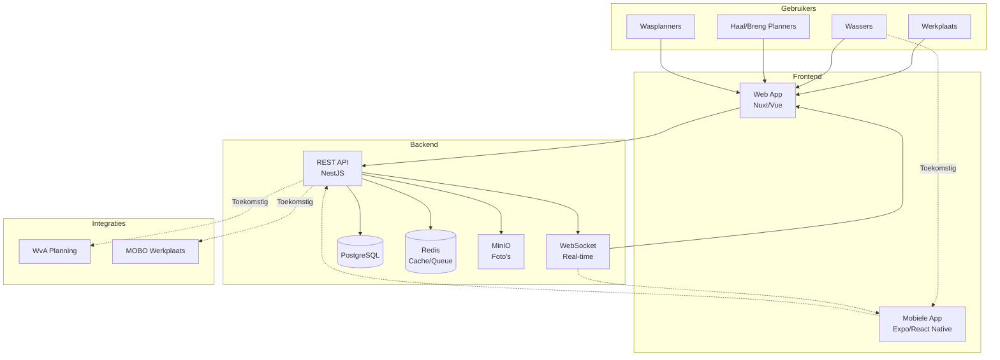

# Technical Overview - Wasplanning Systeem

## 📋 Quick Reference

Dit document geeft een beknopt overzicht van de technische architectuur van het wasplanning systeem.

### 🗂️ Documentatie Structuur

- **[technical-overview.md](./technical-overview.md)** - Dit overzicht (start hier)
- **[backend-technical.md](./backend-technical.md)** - NestJS API specificatie
- **[frontend-technical.md](./frontend-technical.md)** - Nuxt 3 web app details
- **[mobile-technical.md](./mobile-technical.md)** - Expo React Native app
- **[development-setup.md](./development-setup.md)** - Developer onboarding
- **[deployment.md](./deployment.md)** - Production deployment guide

## 🏗️ System Architectuur



## 🛠️ Tech Stack

| Component | Technology | Purpose |
|-----------|------------|---------|
| **API** | NestJS + TypeScript | REST API, business logic |
| **Database** | PostgreSQL + TypeORM | Data persistence |
| **Cache/Queue** | Redis + BullMQ | Caching, job queues |
| **File Storage** | MinIO (S3) | Photos, documents |
| **Web App** | Nuxt 3 + Vue | Desktop/tablet interface |
| **Mobile App** | Expo + React Native | Mobile wassers |
| **Real-time** | Socket.io | Live updates |
| **Auth** | JWT + Role-based | Security |
| **Payments** | Mollie Gateway | Subscription billing |

## 🎯 Core Features

### Multi-Tenancy & Multi-Location
- **Tenant Isolation**: Complete data separation between garages
- **Row-Level Security**: Database-level tenant filtering
- **Tenant-Aware API**: All endpoints respect tenant context
- **Multi-Location Support**: Each tenant can have multiple physical locations
- **Location-Specific Data**: Wash tasks, users, and vehicles can be location-specific
- **Cross-Location Management**: Wasplanners can manage multiple locations within their tenant
- **Garage Admin**: Self-service garage management for all locations
- **Super Admin**: Cross-tenant oversight and management

### Automatic Planning
- **Smart Assignment**: Capacity + skills matching (per garage)
- **Priority Queue**: Return trip time based
- **Auto Redistribution**: Sick leave handling
- **Delay Alerts**: 80% completion warnings

### User Roles (Per Tenant)
- **Werkplaats**: Submit wash requests
- **Wassers**: Execute wash tasks, update status
- **Haal/Breng Planners**: Monitor completion for return trips  
- **Wasplanners**: Manage queue and assignments
- **Garage Admin**: Manage users and settings for their garage
- **Super Admin**: Manage all garages and global settings

### Mobile App (Future)
- **License Plate Recognition**: Camera OCR
- **Push Notifications**: New task alerts
- **Photo Capture**: Before/after documentation
- **Real-time Sync**: Status updates

## 🚀 Development Quick Start

```bash
# 1. Install everything
npm run install:all

# 2. Setup services
npm run db:setup
npm run storage:setup

# 3. Start development
npm run dev            # Web app + API + DB
npm run dev:mobile     # Mobile app (separate terminal)
```

**Access Points:**
- Web App: http://localhost:3001
- API: http://localhost:3000
- Swagger: http://localhost:3000/api/docs
- MinIO Console: http://localhost:9001

## 📂 Project Structure

```
wasplanning/
├── backend/          # NestJS API
├── frontend/         # Nuxt 3 app  
├── mobile/           # Expo app
├── docker/           # Docker configs
├── scripts/          # Dev utilities
└── docs/             # Technical docs
```

## 🔄 Data Flow

1. **Werkplaats** → Meldt auto klaar voor wassen
2. **System** → Bepaalt prioriteit (retourrit tijd)
3. **Wasplanner** → Wijst toe aan beschikbare wasser
4. **Wasser** → Start wasbeurt, update status
5. **System** → Real-time melding naar planners
6. **Haal/Breng** → Plant retourrit bij klant

## 🔐 Security

- **Authentication**: JWT tokens
- **Authorization**: Role-based access control
- **API Security**: Rate limiting, CORS, validation
- **Data**: Encrypted at rest and transit

## 📊 Performance

- **Caching**: Redis voor frequent data
- **Database**: Optimized queries, indexing
- **Real-time**: WebSocket connections
- **Files**: CDN voor static assets

## 🎯 Next Steps

1. **Phase 1**: Core web app + API (MVP)
2. **Phase 2**: Mobile app development
3. **Phase 3**: WvA integration
4. **Phase 4**: MOBO integration

Voor gedetailleerde implementatie, zie de specifieke technische documenten hierboven.