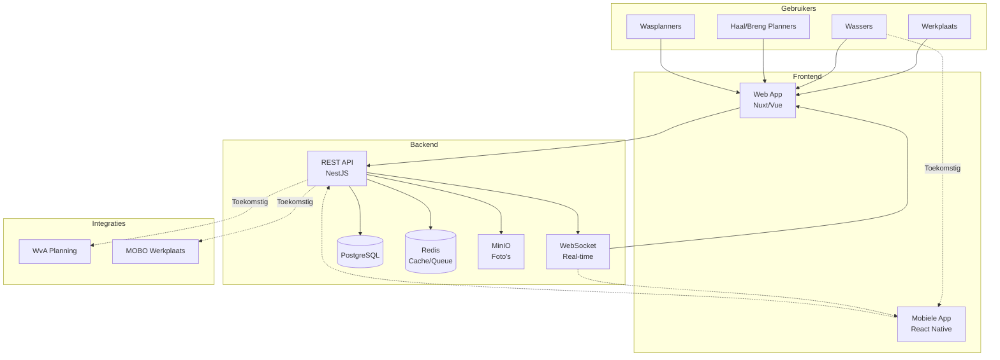
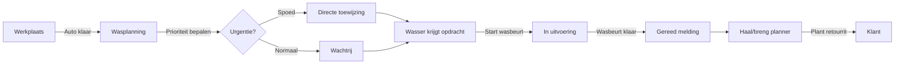
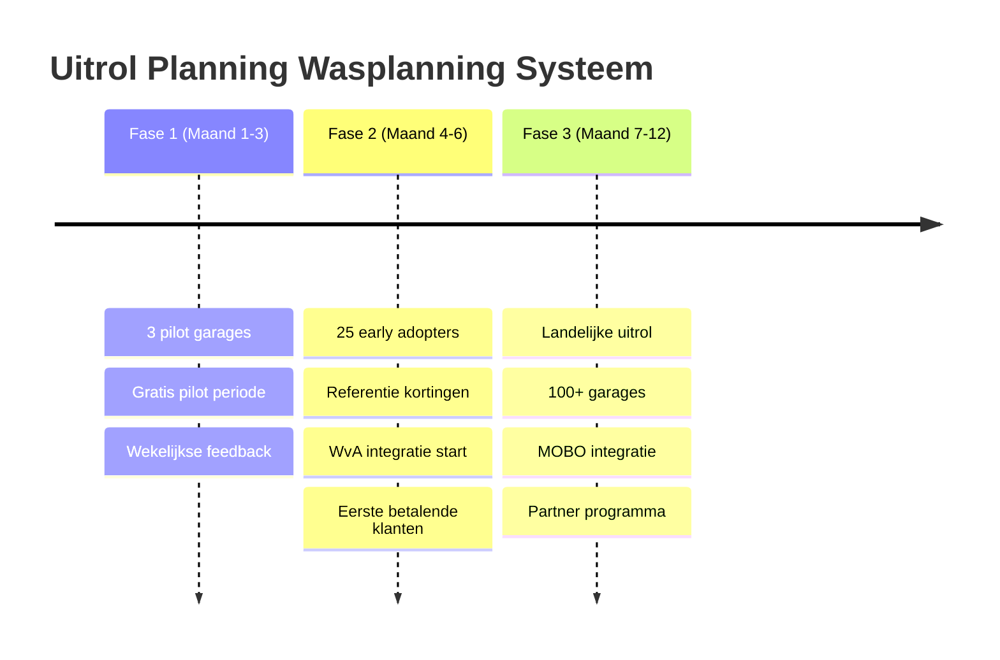
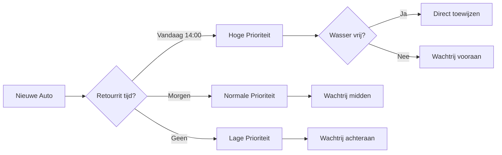

# Wasplanning Systeem

## Probleem
Garages hebben efficiënte coördinatie nodig tussen werkplaats, wasstraat en planningsafdeling om auto's op tijd gewassen te krijgen voor retourritten naar klanten.

## Oplossing
Digitaal wasplanning platform dat communicatie en tracking tussen alle afdelingen stroomlijnt, met toekomstige integratie met WvA (haal/breng planning) en MOBO (werkplaatsplanning).

## Belangrijkste Functionaliteiten

- **Real-time Status Tracking**: Werkplaats meldt aan → Waswachtrij → Gereed status
- **Rolgebaseerde Toegang**: 
  - Werkplaats (alleen aanmelden)
  - Wassers (bekijken & status updaten)  
  - Planners haal/breng (alleen inzien voor retourrit planning)
  - Wasplanners (beheer wachtrij en toewijzing)
- **Flexibele Wasduur**: Instelbare tijden per type wasbeurt
- **Spoedopdrachten**: Prioriteit systeem voor urgente wassen
- **Multi-wasser Support**: Meerdere wassers kunnen aan één auto werken
- **Configureerbare Werktijden**: Instelbaar voor binnen/buiten kantooruren
- **Open API**: Swagger documentatie voor toekomstige integraties

## Gebruikersvoordelen

### Werkplaats
- Eenvoudig auto's aanmelden voor wasbeurt
- Geen handmatige coördinatie meer

### Wassers  
- Overzichtelijke werklijst
- Duidelijke prioriteiten (spoed/normaal)
- Mobiel-vriendelijke interface
- Mogelijkheid om samen te werken aan één auto

### Haal/Breng Planners
- Real-time inzicht in wasstatus
- Zekerheid over gereedheid voor retourrit
- Geen verrassingen bij klantaflevering

### Wasplanners
- Beheer van wachtrij en capaciteit
- Toewijzing aan beschikbare wassers
- Inzicht in doorlooptijden

## Werkproces

1. **Aanmelding**: Werkplaats meldt auto klaar voor wassen
2. **Prioritering**: Systeem bepaalt urgentie (retourrit tijd, spoedopdracht)
3. **Toewijzing**: Wasplanner wijst toe aan beschikbare wasser(s)
4. **Uitvoering**: Wasser(s) voeren wasbeurt uit
5. **Afmelding**: Wasser meldt auto gereed
6. **Notificatie**: Planner ziet auto is klaar voor retourrit

## Configuratie Opties

- **Wasduur**: Instelbaar per type (snel/standaard/uitgebreid)
- **Wasplekken**: Instelbaar per garage (vast of flexibel)
- **Shifts**: Optioneel roostersysteem voor wassers
- **Werktijden**: Instelbaar per locatie
- **Toekomstige klantentoegang**: Foto's voor/na wasbeurt

## Toekomstige Mobiele App

- **Native app** voor wassers en planners
- **Push notificaties** bij nieuwe opdrachten of statuswijzigingen
- **Kenteken herkenning** via camera voor snelle auto identificatie
- **Foto's maken** direct vanuit de app voor/na wasbeurt
- **Barcode scanner** voor werkorder scanning

## Marktpotentieel
- 2,500+ grotere garages in Nederland
- Focus op garages met haal/breng service
- 90% werkt nog met handmatige processen/papier

## Prijsmodel
- **Basis**: €49/maand per locatie
- **Pro**: €79/maand (met shifts & rapportages)
- **Enterprise**: €99/maand (API integraties)
- **Alternatieven**: 
  - €5/maand per wasser
  - €0,50 per gewassen auto
- Geen setup kosten
- 30 dagen gratis proberen

## Go-to-Market Strategie

### Fase 1: Pilot (Maand 1-3)
- 3 pilot garages
- Focus op garages met 5+ wassers
- Gratis tijdens pilot periode
- Wekelijkse feedback sessies

### Fase 2: Early Adopters (Maand 4-6)  
- Uitrol naar 25 garages
- Referentie kortingen voor pilot klanten
- Begin integratie met WvA systeem

### Fase 3: Opschaling (Maand 7-12)
- Landelijke uitrol
- Partnerships met garage software leveranciers
- MOBO integratie ontwikkeling

## Automatische Planningshulp

Het systeem biedt slimme planningsondersteuning:

### Automatische Toewijzing
- **Capaciteit matching**: Koppelt auto's aan beschikbare wassers op basis van:
  - Huidige werkbelasting
  - Vaardigheden (quick wash, polish, detailing)
  - Geschatte wasduur
- **Retourrit prioriteit**: Auto's met vroege retourrit krijgen automatisch voorrang
- **Load balancing**: Verdeel werk gelijkmatig over alle wassers

### Slimme Meldingen
- **Uitloop detectie**: Bij 80% van geschatte tijd waarschuwing naar wasser
- **Escalatie**: Als wasbeurt uitloopt → melding naar haal/breng planner
- **Herverdeling**: Bij ziekte/afwezigheid automatisch taken herverdelen

### Planning Optimalisatie

## Success Metrics
- 75% minder handmatige communicatie over wasstatus
- 100% zekerheid over gereedheid voor retourrit
- <5 minuten om nieuwe wasorder aan te maken
- ROI binnen 3 maanden door tijdsbesparing