# Wasplanning Systeem

## Probleem
Garages hebben efficiënte coördinatie nodig tussen werkplaats, wasstraat en planningsafdeling om auto's op tijd gewassen te krijgen voor retourritten naar klanten.

## Oplossing
Digitaal wasplanning platform dat communicatie en tracking tussen alle afdelingen stroomlijnt, met toekomstige integratie met WvA (haal/breng planning) en MOBO (werkplaatsplanning).

## Belangrijkste Functionaliteiten

- **Real-time Status Tracking**: Werkplaats meldt aan → Waswachtrij → Gereed status
- **Rolgebaseerde Toegang**: 
  - Werkplaats (alleen aanmelden)
  - Wassers (bekijken & status updaten)  
  - Planners haal/breng (alleen inzien voor retourrit planning)
  - Wasplanners (beheer wachtrij en toewijzing)
- **Flexibele Wasduur**: Instelbare tijden per type wasbeurt
- **Spoedopdrachten**: Prioriteit systeem voor urgente wassen
- **Multi-wasser Support**: Meerdere wassers kunnen aan één auto werken
- **Configureerbare Werktijden**: Instelbaar voor binnen/buiten kantooruren
- **Open API**: Swagger documentatie voor toekomstige integraties

## Automatische Planningshulp

Het systeem biedt slimme planningsondersteuning:

### Automatische Toewijzing
- **Capaciteit matching**: Koppelt auto's aan beschikbare wassers op basis van:
  - Huidige werkbelasting
  - Vaardigheden (quick wash, polish, detailing)
  - Geschatte wasduur
- **Retourrit prioriteit**: Auto's met vroege retourrit krijgen automatisch voorrang
- **Load balancing**: Verdeel werk gelijkmatig over alle wassers

### Slimme Meldingen
- **Uitloop detectie**: Bij 80% van geschatte tijd waarschuwing naar wasser
- **Escalatie**: Als wasbeurt uitloopt → melding naar haal/breng planner
- **Herverdeling**: Bij ziekte/afwezigheid automatisch taken herverdelen

### Planning Optimalisatie

## Gebruikersvoordelen

### Werkplaats
- Eenvoudig auto's aanmelden voor wasbeurt
- Geen handmatige coördinatie meer

### Wassers  
- Overzichtelijke werklijst per garage
- Duidelijke prioriteiten (spoed/normaal)
- Mobiel-vriendelijke interface
- Mogelijkheid om samen te werken aan één auto

### Haal/Breng Planners
- Real-time inzicht in wasstatus
- Zekerheid over gereedheid voor retourrit
- Geen verrassingen bij klantaflevering

### Wasplanners
- Beheer van wachtrij en capaciteit per locatie
- Toewijzing aan beschikbare wassers
- Inzicht in doorlooptijden

### Garage Eigenaren/Managers
- **Multi-locatie beheer** vanuit één dashboard
- **Prestatie vergelijking** tussen verschillende vestigingen
- **Centrale gebruikersbeheer** voor de hele keten
- **Consistent merk experience** met eigen logo/kleuren

## Werkproces

1. **Aanmelding**: Werkplaats meldt auto klaar voor wassen
2. **Prioritering**: Systeem bepaalt urgentie (retourrit tijd, spoedopdracht)
3. **Toewijzing**: Wasplanner wijst toe aan beschikbare wasser(s)
4. **Uitvoering**: Wasser(s) voeren wasbeurt uit
5. **Afmelding**: Wasser meldt auto gereed
6. **Notificatie**: Planner ziet auto is klaar voor retourrit

## Multi-Tenant Architectuur

Het systeem ondersteunt meerdere garages/locaties binnen één installatie:

### Tenant Isolation
- **Volledige scheiding** van data tussen verschillende garages
- **Gebruikers** behoren tot één specifieke garage
- **Auto's en wastaken** zijn tenant-specifiek
- **Configuratie** per garage (werktijden, wasplekken, etc.)

### Garage Beheer
- **Hoofdbeheerder** kan nieuwe garages toevoegen
- **Garage Admin** beheert eigen locatie en gebruikers
- **Automatische onboarding** voor nieuwe garages
- **Centrale rapportage** voor franchise/keten beheer

## Dashboard & Inzichten

Real-time overzicht van alle belangrijke cijfers:

### Operationeel Dashboard
- **Live wachtrij status** met gemiddelde wachttijden
- **Wasserproductiviteit** per medewerker/team
- **Doorlooptijden** per type wasbeurt
- **Uitloop alerts** voor retourritten

### Management Rapportages
- **Maandoverzicht** aantal wassen per locatie
- **Prestatie vergelijking** tussen vestigingen
- **Piekuren analyse** voor betere planning
- **Trend grafieken** voor capaciteitsplanning

### Export Mogelijkheden
- Download rapporten als PDF/Excel
- API toegang voor eigen BI tools (Groei/Enterprise)

## Configuratie Opties

- **Wasduur**: Instelbaar per type (snel/standaard/uitgebreid)
- **Wasplekken**: Instelbaar per garage (vast of flexibel)
- **Shifts**: Optioneel roostersysteem voor wassers
- **Werktijden**: Instelbaar per locatie
- **Tenant Instellingen**: Logo, kleuren, bedrijfsnaam per garage
- **Toekomstige klantentoegang**: Foto's voor/na wasbeurt

## Toekomstige Mobiele App

- **Native app** voor wassers en planners
- **Push notificaties** bij nieuwe opdrachten of statuswijzigingen
- **Kenteken herkenning** via camera voor snelle auto identificatie
- **Foto's maken** direct vanuit de app voor/na wasbeurt
- **Barcode scanner** voor werkorder scanning

## Marktpotentieel
- 2,500+ grotere garages in Nederland
- Focus op garages met haal/breng service
- 90% werkt nog met handmatige processen/papier

## Prijsmodel

### Betaling & Facturatie
- **Veilige betalingen** via Mollie payment gateway
- **Automatische incasso** voor maandelijkse abonnementen
- **Ondersteuning** voor alle Nederlandse betaalmethoden (iDEAL, Bancontact, creditcard)
- **Prorating** bij pakket upgrades/downgrades
- **Automatische factuur** generatie en verzending
- **BTW compliance** volgens Nederlandse wetgeving

### Drie Transparante Pakketten

```mermaid
graph TD
    subgraph "🚗 Starter - €49/maand"
        S1[1 locatie]
        S2[Tot 500 auto's/maand]
        S3[5 gebruikers]
        S4[Basis functies]
    end
    
    subgraph "🏢 Groei - €149/maand"
        G1[Tot 3 locaties]
        G2[Tot 2.000 auto's/maand]
        G3[Onbeperkt gebruikers]
        G4[Alle functies + API]
    end
    
    subgraph "🏭 Enterprise - €299/maand"
        E1[Onbeperkt locaties]
        E2[Onbeperkt auto's]
        E3[Multi-tenant dashboard]
        E4[Custom integraties]
    end
```

#### 🚗 **Starter** - €49/maand
- **1 locatie**
- **Tot 500 auto's/maand**
- Basis functies
- 5 gebruikers
- Email support

#### 🏢 **Groei** - €149/maand  
- **Tot 3 locaties**
- **Tot 2.000 auto's/maand**
- Alle functies + rapportages
- Onbeperkt gebruikers
- Priority support
- API toegang

#### 🏭 **Enterprise** - €299/maand
- **Onbeperkt locaties**
- **Onbeperkt auto's**
- Multi-tenant dashboard
- Custom integraties
- Dedicated support
- SLA garantie
- Custom branding

### Extra Opties
- **Extra locatie** (Groei pakket): €39/locatie/maand
- **Overschrijding auto's**: €0,10 per extra auto
- **WhiteLabel**: €99/maand extra
- **On-premise installatie**: Op aanvraag

### Voordelen
- **Geen setup kosten**
- **30 dagen gratis proberen**
- **Maandelijks opzegbaar**
- **Inclusief updates**

## Go-to-Market Strategie

### Fase 1: Pilot (Maand 1-3)
- 3 pilot garages
- Focus op garages met 5+ wassers
- Gratis tijdens pilot periode
- Wekelijkse feedback sessies

### Fase 2: Early Adopters (Maand 4-6)  
- Uitrol naar 25 garages
- Referentie kortingen voor pilot klanten
- Begin integratie met WvA systeem

### Fase 3: Opschaling (Maand 7-12)
- Landelijke uitrol
- Partnerships met garage software leveranciers
- MOBO integratie ontwikkeling

## Success Metrics
- 75% minder handmatige communicatie over wasstatus
- 100% zekerheid over gereedheid voor retourrit
- <5 minuten om nieuwe wasorder aan te maken
- ROI binnen 3 maanden door tijdsbesparing

## Rekenvoorbeeld ROI

### Kleine Garage (300 auto's/maand)
- **Huidige tijdsbesteding**: 10 min/auto coördinatie = 50 uur/maand
- **Met systeem**: 2 min/auto = 10 uur/maand
- **Besparing**: 40 uur × €35/uur = €1.400/maand
- **Kosten Starter**: €49/maand
- **ROI**: €1.351/maand (2700% rendement)

### Middelgrote Keten (1.500 auto's, 2 locaties)
- **Besparing**: 200 uur × €35 = €7.000/maand
- **Kosten Groei**: €149/maand
- **ROI**: €6.851/maand